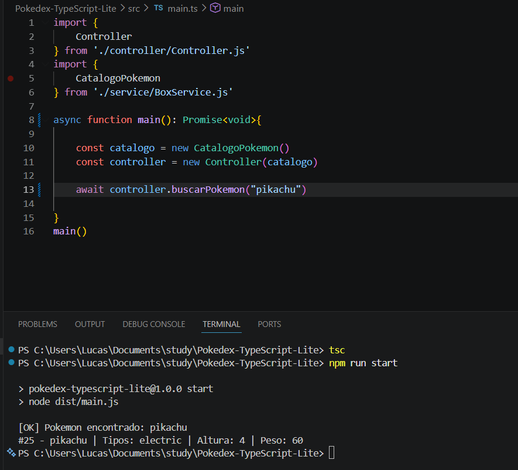
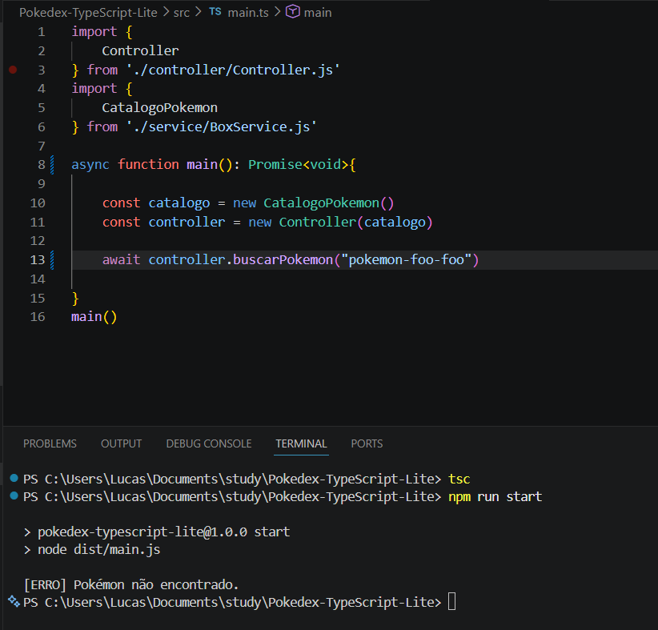
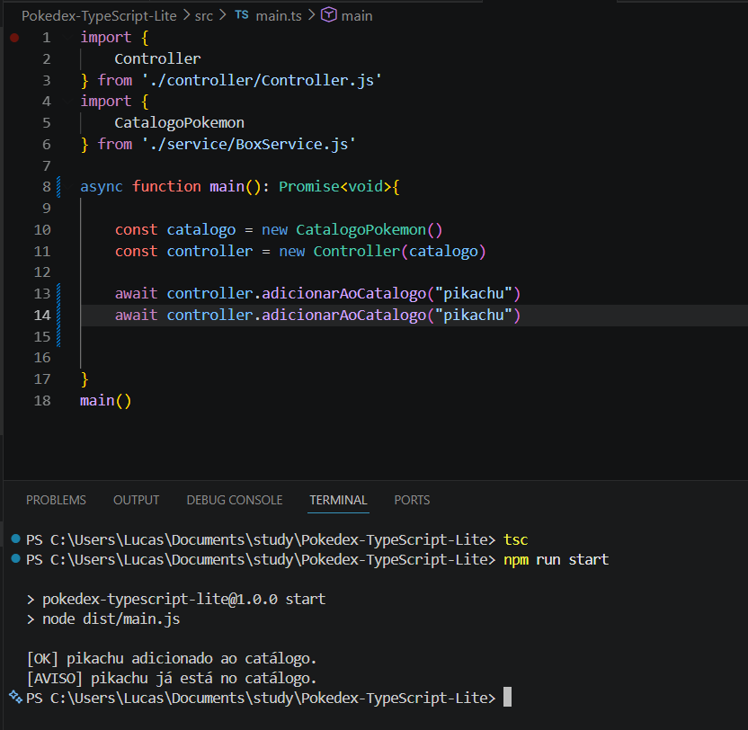
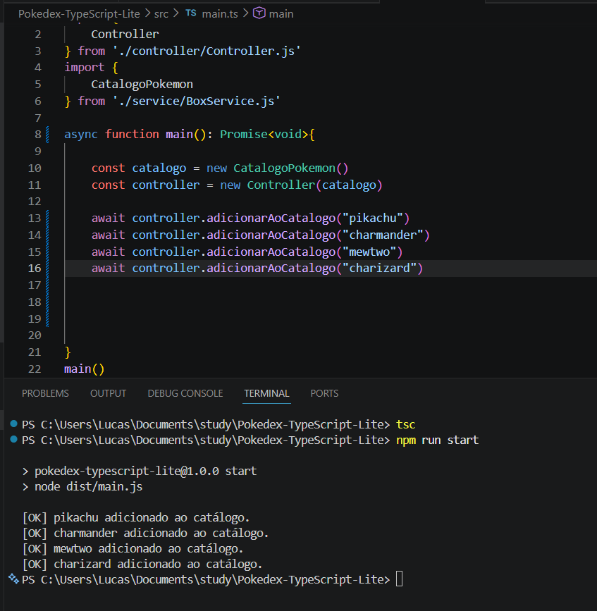
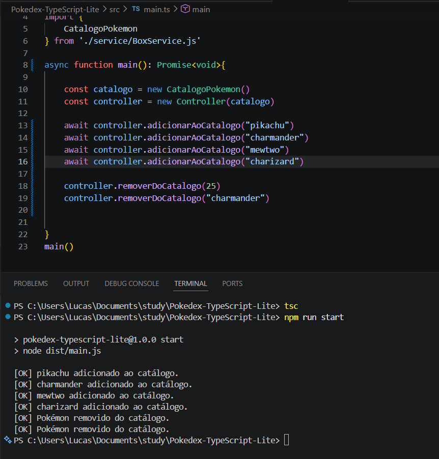
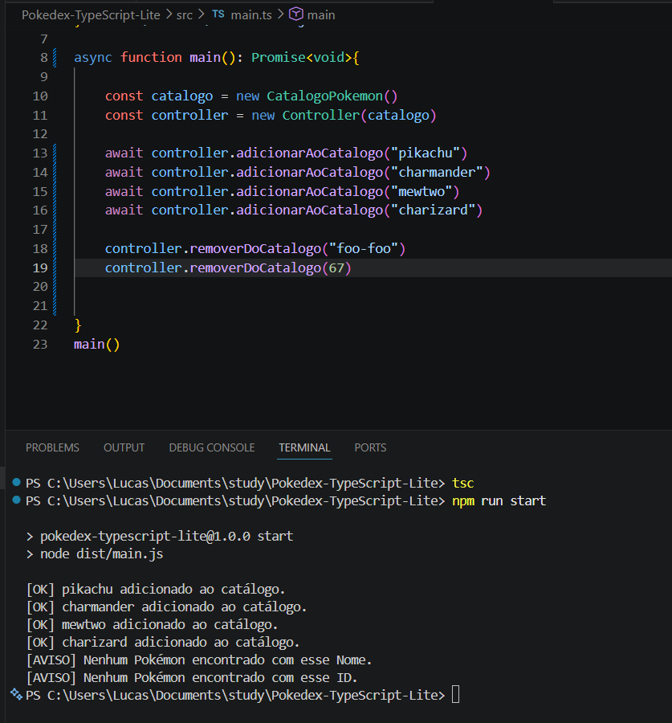
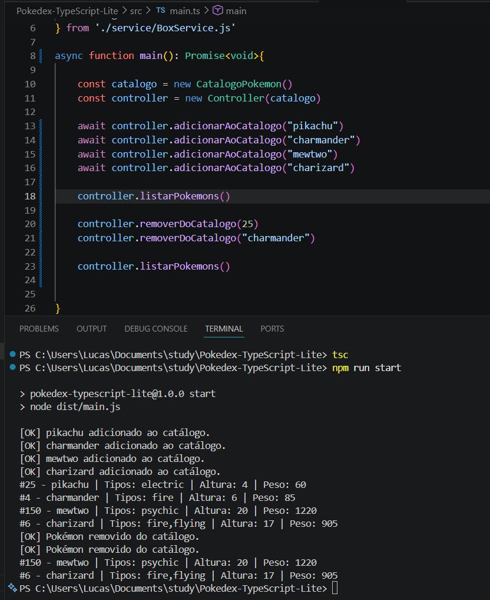

# Pokédex TypeScript Lite 
## Sobre o projeto 
O Pokédex TypeScript Lite é uma aplicação simples em Node.js com TypeScript 
que consulta dados de Pokémon na PokeAPI e organiza alguns resultados em um 
catálogo local durante a execução do programa. 
## Objetivo 
Praticar os principais conceitos do Módulo 01: - Node.js; - JavaScript no back-end; - TypeScript; - interfaces; - funções tipadas; - arrays; - objetos; - JSON; - métodos de array; - classes; - async/await; - fetch; - tratamento de erros; - GitHub; - GitFlow; - Kanban. 
## Tecnologias utilizadas 
- Node.js 
- TypeScript 
- TSX 
- PokeAPI 
- Git 
- GitHub

## Pré-requisitos 
Antes de executar o projeto, é necessário ter instalado: - Node.js - npm - Git 
## Como instalar 
Clone o repositório: 
```bash 
git clone LINK_DO_REPOSITORIO 
Acesse a pasta do projeto: 
cd pokedex-typescript-lite 
Instale as dependências: 
npm install 
Como executar 
Execute o projeto em ambiente de desenvolvimento: 
npm run dev 
Estrutura do projeto 
pokedex-typescript-lite/ 

│ 
├── src/ 
│   ├── main.ts 
│   ├── model/
│   │    └── Pokemon.ts
│   ├── controller/
│   │    └── Controller.ts
│   ├── service/
│   │    ├──PokeApiService.ts
│   │    └──BoxService.ts
│   └── images/
├── package.json 
├── tsconfig.json 
└── README.md 
```
Funcionalidades 
- Buscar Pokémon por nome ou ID 
- Tratar erro de Pokémon inexistente
 Transformar resposta da API em objeto simplificado 
 - Adicionar Pokémon ao catálogo local 
 - Impedir Pokémon duplicado 
 - Listar catálogo 
 - Remover Pokémon por ID 
 - Exibir mensagens no terminal 
 - Exemplos de execução 
 - Busca válida

### Entrada testada: pikachu 
- Saída obtida: [OK] Pokémon encontrado: pikachu 
- #25 - pikachu | Tipos: electric | Altura: 4 | Peso: 60

 

### Busca inválida: pikachu-foo-foo 
- Saída obtida: [ERRO] Pokémon não encontrado.



### Duplicidade: adicionar pikachu duas vezes 
- Saída obtida: [AVISO] pikachu já está no catálogo.



### Adicionar pokemon ao catalogo local:
 - Saida obtida: [OK] Pokemon adicionado ao catalogo



### Remoção 
 - Entrada testada: remover ID 25 e Nome "charmander" 
 - Saída obtida: [OK] Pokémon removido do catálogo.



### Remoção de Pokemon inexistente:
- Entrada testada: id inválido e nome inválido



### Listar Catálogo Local:
- Entrada: listar pokemons antes e depois de remover
- Saída esperada: #ID | Nome: | Tipos: | Altura: | Peso: (pokemons do catálogo)



### Conceitos aplicados 
#### TypeScript: 
Explique onde foram utilizados tipos, interfaces, parâmetros e retornos tipados.
Interface PokemonResumo 
Explique o objetivo da interface criada para representar os dados 
simplificados do Pokémon. 
#### Fetch e async/await 
Explique como a aplicação consulta a PokeAPI. 
Tratamento de erros 
Explique como o projeto lida com Pokémon inexistente ou erro de busca. 
#### Métodos de array 
Informe onde foram usados map, filter, find, some, every, reduce ou 
forEach. 
#### Classe CatalogoPokemon 
Explique quais atributos e métodos foram criados. 
#### Organização do Kanban 
Link do Kanban: COLE_AQUI_O_LINK 

### Branches utilizadas
 - main 
 - develop 
 - docs

### Melhorias futuras 
- Criar menu interativo no terminal 
- Salvar catálogo em arquivo JSON 
- Exibir HP, ataque e defesa 
- Criar filtros por tipo de Pokémon 
- Criar uma API própria com Express 